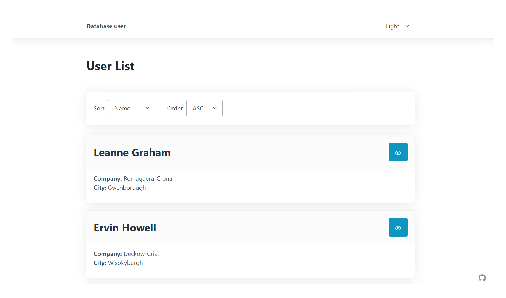
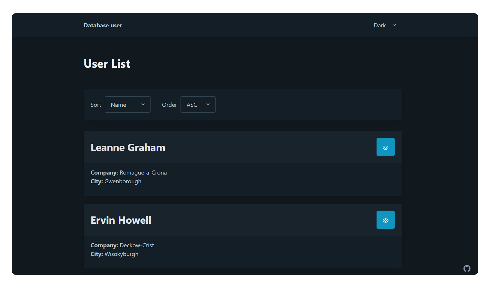
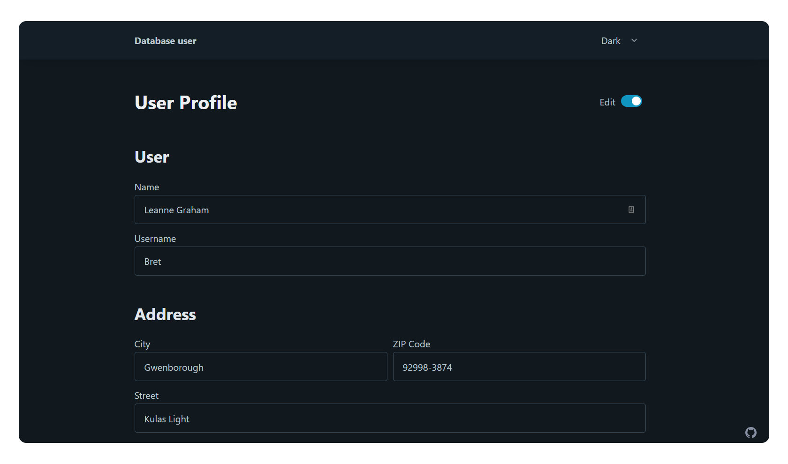

# DataBase User REST API  with color theme switcher 

## Features

- See all users from the API on the homepage
- Sort user by name, company, city
- Change between ASC and DESC sort
- Click on a user card to see more detailed information
- Change user data with simple validation and `PUT` on server
- Toggle the color scheme between light, dark auto mode

## Screenshot

## Links

- Solution URL: https://github.com/FightM9/users-list-rest
- Live Site URL:  https://users-list-rest.vercel.app/

## Process

### Built with

- [Typescript](https://www.typescriptlang.org/) - Syntactical superset of JavaScript
- [React](https://reactjs.org/) – JS library
- [React Router v6](https://reactrouter.com/) – for page routing
- [PicoCSS](https://picocss.com/) – minimal CSS Framework for semantic HTML
- [Redux Toolkit](https://redux-toolkit.js.org/)  – A predictable state container for JavaScript applications
- [Styled-components](https://styled-components.com/) – For styles
- [Axios](https://axios-http.com/) – Http Client
- [Redux-thunk](https://github.com/reduxjs/redux-thunk) – middleware for Redux. 

### Useful resources

- [React Docs ](https://reactjs.org/)
- [Redux Toolkit Docs](https://redux-toolkit.js.org/introduction/getting-started)
- [Redux Docs](https://redux.js.org/)
- [Typescript Handbook](https://www.typescriptlang.org/docs/handbook/intro.html)